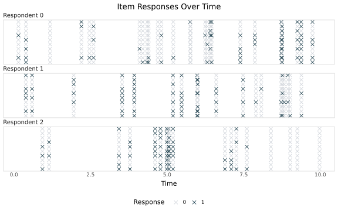
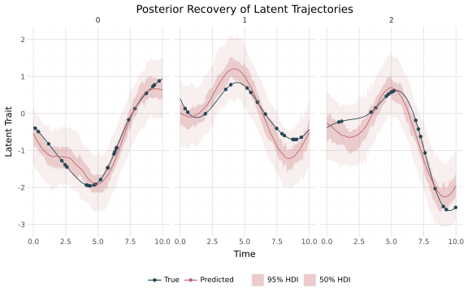

# dynamirt 🧨

**dynamirt** is a Python/NumPyro package for static and longitudinal
multidimensional item response theory (MIRT). It is built for repeated binary
or ordinal item responses collected at irregular times, including ragged
panel and EMA data where respondents have different numbers and schedules of
observations.

Models are assembled from two parts: a *measurement model* (item intercepts or
thresholds, loadings, asymptotes and optional DIF) and a *latent model* made of
additive terms such as linear effects, random walks, AR(1) processes and
Gaussian processes. Models are fitted with MCMC or SVI.

<table>
  <tr>
    <td></td>
    <td></td>
  </tr>
</table>

## Installation

dynamirt requires Python 3.10 or newer.

```bash
python -m pip install dynamirt
```

[Documentation](https://dynamirt.readthedocs.io/en/latest/)

## Building a model

`dynamirt()` builds a NumPyro model from a measurement model and a latent
model. It returns a model callable, which you fit with `fit_mcmc` or `fit_svi`:

```python
from dynamirt import dynamirt, fit_mcmc, Confirmatory

model = dynamirt(model_type="2PL", n_latent=2, loadings=Confirmatory(Q, positive=Q))
fit = fit_mcmc(model, responses, covariates)
idata = fit.to_idata()
```

## Supported measurement models

| `model_type` | Response | Model |
|---|---|---|
| `"1PL"` | Binary | Rasch model (loadings fixed to 1) |
| `"2PL"` | Binary | Item intercepts and loadings |
| `"3PL"` | Binary | 2PL with a lower asymptote (guessing) |
| `"4PL"` | Binary | 3PL with an upper asymptote (slipping) |
| `"GRM"` | Ordinal | Graded response model |
| `"PCM"` | Ordinal | Partial credit model (loadings fixed to 1) |
| `"GPCM"` | Ordinal | Generalized partial credit model |

## Built with

- [NumPyro](https://num.pyro.ai/)
- [JAX](https://docs.jax.dev/en/latest/index.html)
- [ArviZ](https://www.arviz.org/en/latest/)
- [tinygp](https://tinygp.readthedocs.io/en/stable/)

## Other IRT and latent variable software

### R

- [mirt](https://github.com/philchalmers/mirt) — Multidimensional item response theory in R
- [emIRT](https://github.com/kosukeimai/emIRT) — EM Algorithms for Estimating Item Response Theory Models (including ideal point estimation over time)
- [gllvm](https://github.com/JenniNiku/gllvm) — Generalized linear latent variable models
- [Hmsc](https://github.com/hmsc-r/HMSC) — Hierarchical Modelling of Species Communities

### Python

- [py-irt](https://github.com/nd-ball/py-irt) — A Scalable Item Response Theory Library for Python
- [girth](https://github.com/eribean/girth) — A python package for estimating item response theory (IRT) parameters
