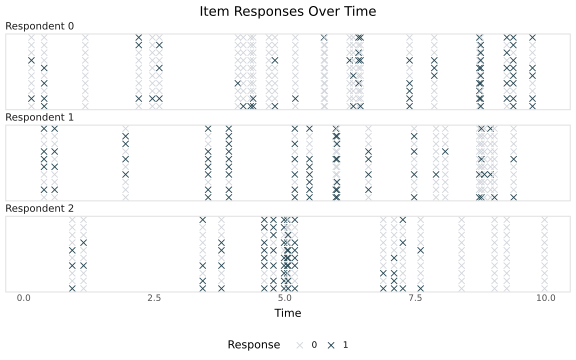
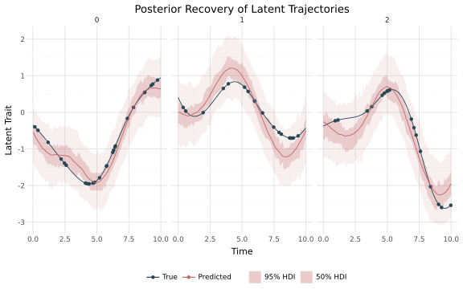

# dynamirt 🧨

**dynamirt** is a Python/NumPyro package for Bayesian static and longitudinal
multidimensional [item response theory](https://en.wikipedia.org/wiki/Item_response_theory) (MIRT). 
It provides an interface to the most common IRT measurement models and lets you freely specify the functional 
form of the latent trait. 
The built-ins (GPs, HSGPs) make it heavily geared toward repeated binary
or ordinal item responses collected at irregular times, including ragged
panel and ecological momentary assessment (EMA) data where respondents have different numbers and schedules of
observations.

<table>
  <tr>
    <td></td>
    <td></td>
  </tr>
</table>

## Installation

dynamirt requires Python 3.10 or newer.

```bash
python -m pip install dynamirt
```

If you want to use dynamirt on GPU you need to install it into an environment with [GPU-enabled JAX](https://docs.jax.dev/en/latest/installation.html).
Otherwise the default CPU-only JAX will be installed.

## Documentation

https://dynamirt.readthedocs.io/

## Building a model

`dynamirt()` builds a NumPyro model from a measurement model and a latent
model. It returns a model callable, which you fit with `fit_mcmc` or `fit_svi`:

```python
from dynamirt import dynamirt, fit_mcmc, Confirmatory

model = dynamirt(model_type="2PL", n_latent=2, loadings=Confirmatory(Q, positive=Q))
fit = fit_mcmc(model, responses, covariates)
idata = fit.to_idata()
```

## Supported measurement models

| `model_type` | Response | Model |
|---|---|---|
| `"1PL"` | Binary | Rasch model (loadings fixed to 1) |
| `"2PL"` | Binary | Item intercepts and loadings |
| `"3PL"` | Binary | 2PL with a lower asymptote (guessing) |
| `"4PL"` | Binary | 3PL with an upper asymptote (slipping) |
| `"GRM"` | Ordinal | Graded response model |
| `"PCM"` | Ordinal | Partial credit model (loadings fixed to 1) |
| `"GPCM"` | Ordinal | Generalized partial credit model |

## Built with

- [NumPyro](https://num.pyro.ai/)
- [JAX](https://docs.jax.dev/en/latest/index.html)
- [ArviZ](https://www.arviz.org/en/latest/)
- [tinygp](https://tinygp.readthedocs.io/en/stable/)

## Other IRT and latent variable software

### R

- [mirt](https://github.com/philchalmers/mirt) — Multidimensional item response theory in R
- [emIRT](https://github.com/kosukeimai/emIRT) — EM Algorithms for Estimating Item Response Theory Models (including ideal point estimation over time)
- [gllvm](https://github.com/JenniNiku/gllvm) — Generalized linear latent variable models
- [Hmsc](https://github.com/hmsc-r/HMSC) — Hierarchical Modelling of Species Communities

### Python

- [py-irt](https://github.com/nd-ball/py-irt) — A Scalable Item Response Theory Library for Python
- [girth](https://github.com/eribean/girth) — A python package for estimating item response theory (IRT) parameters
